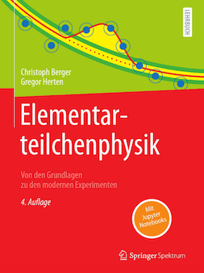

# Book Elementarteilchenphysik, 4th edition

The book is written in German

Springer Verlag

Further information, corrections, python code and notebooks: [GitHub code](https://github.com/BuchEPP/Buch)

### Authors
#### Christoph Berger
- Christoph Berger, born in 1939, studied in Darmstadt and Bonn and received his doctorate in Bonn in 1968. He carried out post-doctoral research at Cornell University. After his habilitation in Aachen in 1973, he was Professor of High Energy Physics at RWTH Aachen University from 1974 to 2004, with research visits to DESY and CERN. His main research activities are elastic and inelastic electron-proton scattering, electron-photon scattering and neutrino reactions at low energies.

#### Gregor Herten 
- Gregor Herten, born in 1955, studied at RWTH Aachen University and was awarded his doctorate there in 1983. He then carried out post-doctoral research at CERN. After a professorship at the Massachusetts Institute of Technology (1986-1992), he was Professor of Experimental Physics at the University of Freiburg from 1992 to 2023. His research activities deal with the measurement of reactions in 𝑒-𝑒+ annihilation and in proton-proton collisions as well as the development of precise detectors for muons.

### Information about the book 
This textbook on elementary particle physics, written in German, provides an introduction from the basics to modern experiments to the latest developments in particle physics. Experimental tools such as accelerators and detectors as well as the symmetry principles and their applications are also presented in detail. In addition, the Standard Model - which largely dominates today's experimental and theoretical discussion - is introduced. To this end, the book explains essential areas of quantum electrodynamics, the quark model, quantum chromodynamics and electroweak theory. The Lagrangian formalism formulates the standard model as a gauge theory and the Higgs mechanism is described in detail. Chapters on the physics of hadron colliders and neutrino physics tie in with current research and also examine possible extensions of the Standard Model in the light of recent experimental results. The appealing design of the textbook and the 187 exercises with solution instructions and supplements as Jupyter Notebooks on GitHub subsequently serve to deepen the knowledge.
The book is published by Springer with [DOI: 10.1007/978-3-662-67387-4](<https://doi.org/10.1007/978-3-662-67387-4>).

### Calculations with python
The very popular programming language Python is part of the curriculum at many universities. Sympy is a computer algebra programme based on Python. In conjunction with the Jupyter notebook, it provides an elegant framework for computer algebra. Please consult the Python and Jupyter pages to install these programs on your system. On this [GitHub link](<https://github.com/BuchEPP/Buch>) we provide additional material for detailed calculations and solution notes for the exercises. The Python programming is intentionally kept at a simple level so that beginners in programming can get started easily.  

### Contents

#### 1 Überblick und Hilfsmittel
##### 1.1 Inward Bound
##### 1.2 DieElementarteilchen 
##### 1.3 Wirkungsquerschnitteund Zerfallsraten
##### 1.4 Teilchenbeschleuniger 
##### 1.5 Detektoren
##### 1.6 Monte-Carlo-Simulation

